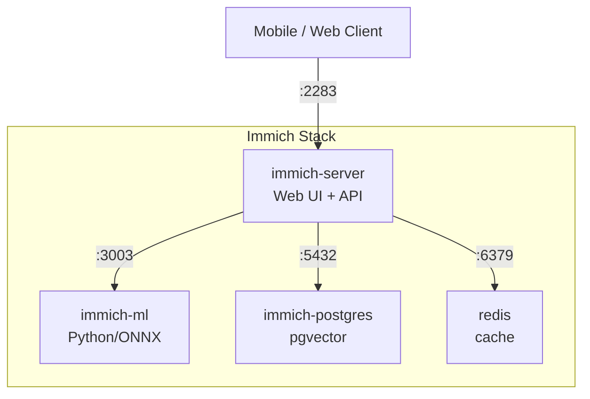

# :simple-googlephotos: Immich Stack

[](https://github.com/daemonless/immich-server/actions)
[](https://github.com/daemonless/immich-ml/actions)
[](https://github.com/daemonless/immich-postgres/actions)

Self-hosted photo and video management solution with facial recognition, object detection, and smart search - running natively on FreeBSD.

!!! tip "What is Immich?"
    Immich is a high-performance, self-hosted alternative to Google Photos. It provides automatic backup from mobile devices, facial recognition, object detection, location-based browsing, and a modern web interface. The Daemonless stack runs entirely on native FreeBSD - no Linux emulation required.

## Architecture

The Immich stack consists of four containers:

| Service | Image | Description |
|---------|-------|-------------|
| **Server** | `ghcr.io/daemonless/immich-server` | Main application server (Node.js) - Web UI and API |
| **Machine Learning** | `ghcr.io/daemonless/immich-ml` | Python/ONNX service for facial recognition and smart search |
| **PostgreSQL** | `ghcr.io/daemonless/immich-postgres` | Database with pgvector extension for ML embeddings |
| **Redis** | `ghcr.io/daemonless/redis` | Cache and job queue |



## Prerequisites

Before deploying, ensure your host environment is ready. See the [Quick Start Guide](../quick-start.md) for host setup instructions.

**Requirements:**

- FreeBSD 15.0 with Podman and ocijail
- `podman-compose` or `podman kube play`
- At least 4GB RAM (ML service is memory-intensive)
- Storage for photos (plan for growth)

## Quick Deploy

=== ":material-rocket-launch: One-Command Setup"

    ```bash
    # Create directory and fetch files
    mkdir -p /containers/immich && cd /containers/immich
    fetch https://raw.githubusercontent.com/daemonless/immich/main/container-compose.yml
    fetch https://raw.githubusercontent.com/daemonless/immich/main/example.env -o .env

    # Edit configuration
    vi .env  # Set UPLOAD_LOCATION, DB_DATA_LOCATION, and DB_PASSWORD

    # Create data directories
    mkdir -p /containers/immich/library /containers/immich/postgres
    chown -R 1000:1000 /containers/immich/library /containers/immich/postgres

    # Start the stack
    podman-compose up -d
    ```

=== ":material-file-document: Manual Setup"

    **Step 1: Create directories**
    ```bash
    mkdir -p /containers/immich
    cd /containers/immich
    ```

    **Step 2: Download compose file**
    ```bash
    fetch https://raw.githubusercontent.com/daemonless/immich/main/container-compose.yml
    ```

    **Step 3: Create environment file**
    ```bash
    cat > .env << 'EOF'
    # Storage locations
    UPLOAD_LOCATION=/containers/immich/library
    DB_DATA_LOCATION=/containers/immich/postgres

    # Database credentials (change the password!)
    DB_PASSWORD=your_secure_password_here
    DB_USERNAME=postgres
    DB_DATABASE_NAME=immich

    # Timezone (optional)
    TZ=America/Los_Angeles
    EOF
    ```

    **Step 4: Create data directories**
    ```bash
    mkdir -p /containers/immich/library
    mkdir -p /containers/immich/postgres
    chown -R 1000:1000 /containers/immich/library
    chown -R 1000:1000 /containers/immich/postgres
    ```

    **Step 5: Start the stack**
    ```bash
    podman-compose up -d
    ```

Access Immich at: **http://your-host:2283**

## Compose File

The complete `container-compose.yml` for reference:

```yaml
name: immich

services:
  immich-server:
    container_name: immich_server
    image: ghcr.io/daemonless/immich-server:latest
    network_mode: host
    volumes:
      - ${UPLOAD_LOCATION}:/data
      - /etc/localtime:/etc/localtime:ro
    environment:
      DB_HOSTNAME: localhost
      REDIS_HOSTNAME: localhost
      IMMICH_MACHINE_LEARNING_URL: http://localhost:3003
    env_file:
      - .env
    depends_on:
      - redis
      - database
      - immich-machine-learning
    restart: always

  immich-machine-learning:
    container_name: immich_machine_learning
    image: ghcr.io/daemonless/immich-ml:latest
    network_mode: host
    environment:
      HF_HOME: /cache/huggingface
      MPLCONFIGDIR: /tmp
    volumes:
      - model-cache:/cache
    env_file:
      - .env
    restart: always

  redis:
    container_name: immich_redis
    image: ghcr.io/daemonless/redis:latest
    network_mode: host
    volumes:
      - /etc/localtime:/etc/localtime:ro
      - redis-data:/config
    restart: always

  database:
    container_name: immich_postgres
    image: ghcr.io/daemonless/immich-postgres:latest
    network_mode: host
    annotations:
      org.freebsd.jail.allow.sysvipc: "true"  # Required for PostgreSQL
    environment:
      POSTGRES_PASSWORD: ${DB_PASSWORD}
      POSTGRES_USER: ${DB_USERNAME}
      POSTGRES_DB: ${DB_DATABASE_NAME}
    volumes:
      - /etc/localtime:/etc/localtime:ro
      - ${DB_DATA_LOCATION}:/var/lib/postgresql/data
    restart: always

volumes:
  model-cache:
  redis-data:
```

## Environment Variables

| Variable | Default | Description |
|----------|---------|-------------|
| `UPLOAD_LOCATION` | `/containers/immich/library` | Path to store uploaded photos and videos |
| `DB_DATA_LOCATION` | `/containers/immich/postgres` | Path to store PostgreSQL database files |
| `DB_PASSWORD` | `postgres` | PostgreSQL password (**change this!**) |
| `DB_USERNAME` | `postgres` | PostgreSQL username |
| `DB_DATABASE_NAME` | `immich` | PostgreSQL database name |
| `TZ` | System default | Timezone (e.g., `America/Los_Angeles`) |

## Ports

| Port | Service | Description |
|------|---------|-------------|
| `2283` | immich-server | Web UI and API |
| `3003` | immich-ml | Machine Learning API (internal) |
| `5432` | immich-postgres | PostgreSQL (internal) |
| `6379` | redis | Redis cache (internal) |

!!! note "Network Mode"
    The stack uses `network_mode: host` for simplicity on FreeBSD. All services communicate via localhost. Only port 2283 needs to be exposed externally.

## FreeBSD-Specific Notes

### PostgreSQL Shared Memory

PostgreSQL requires System V IPC for shared memory. The compose file includes:

```yaml
annotations:
  org.freebsd.jail.allow.sysvipc: "true"
```

This annotation is processed by ocijail to allow the jail access to shared memory.

### Machine Learning Performance

The `immich-ml` container uses:

- **Native FreeBSD onnxruntime** - Custom-built wheel with FreeBSD support
- **CPU inference** - GPU acceleration not currently supported on FreeBSD
- **HuggingFace models** - Downloaded on first run (~1GB cache)

First startup may be slow as ML models are downloaded. Subsequent starts are fast.

## Management

### View Logs

```bash
# All services
podman-compose logs -f

# Specific service
podman logs -f immich_server
podman logs -f immich_machine_learning
```

### Restart Stack

```bash
podman-compose restart
```

### Stop Stack

```bash
podman-compose down
```

### Update Images

```bash
podman-compose pull
podman-compose up -d
```

## Component Documentation

For detailed configuration of individual services:

| Component | Documentation |
|-----------|---------------|
| :material-server: **Server** | [immich-server](immich-server.md) |
| :material-brain: **Machine Learning** | [immich-ml](immich-ml.md) |
| :simple-postgresql: **PostgreSQL** | [immich-postgres](immich-postgres.md) |
| :simple-redis: **Redis** | [redis](redis.md) |

## Troubleshooting

??? question "ML service keeps restarting"
    Check memory - the ML service needs at least 2GB RAM:
    ```bash
    podman logs immich_machine_learning
    ```
    If you see OOM errors, increase available memory or disable ML features in Immich settings.

??? question "Database connection errors"
    Ensure PostgreSQL has started and the sysvipc annotation is working:
    ```bash
    podman logs immich_postgres
    ```
    The database needs a few seconds to initialize on first run.

??? question "Photos not uploading from mobile"
    Ensure port 2283 is accessible from your network. Check firewall rules:
    ```bash
    # PF firewall
    pass in on egress proto tcp to port 2283
    ```

??? question "Facial recognition not working"
    The ML service downloads models on first use. Check if models are cached:
    ```bash
    podman exec immich_machine_learning ls -la /cache/huggingface
    ```

!!! info "Implementation Details"

    - **Platform:** Native FreeBSD 15.0 (no Linux emulation)
    - **Runtime:** ocijail (FreeBSD jails as OCI containers)
    - **ML Backend:** onnxruntime with custom FreeBSD wheel
    - **Database:** PostgreSQL 14 with pgvector extension
    - **Process Manager:** s6-overlay

[Immich Website](https://immich.app/){ .md-button .md-button--primary }
[Immich Docs](https://immich.app/docs/){ .md-button }
[Source Code](https://github.com/immich-app/immich){ .md-button }
